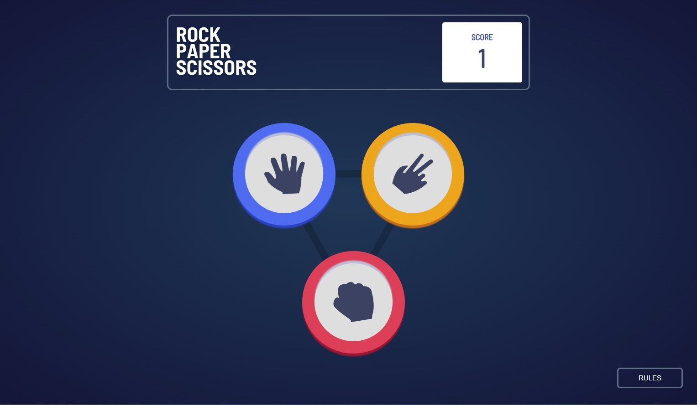
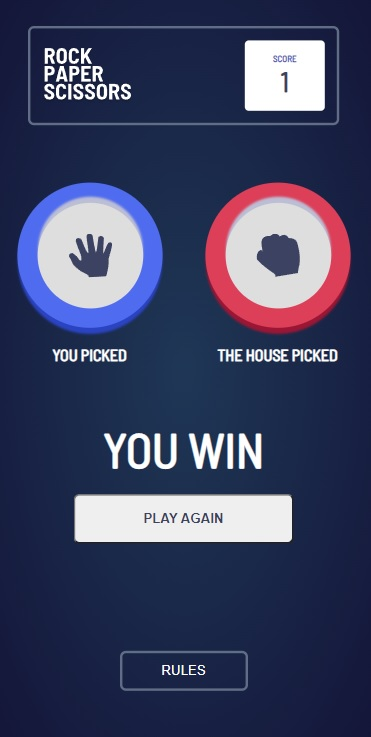

# Frontend Mentor - Rock, Paper, Scissors solution

This is a solution to the [Rock, Paper, Scissors challenge on Frontend Mentor](https://www.frontendmentor.io/challenges/rock-paper-scissors-game-pTgwgvgH). Frontend Mentor challenges help you improve your coding skills by building realistic projects.

## Table of contents

- [Overview](#overview)
  - [The challenge](#the-challenge)
  - [Screenshot](#screenshot)
  - [Links](#links)
- [My process](#my-process)
  - [Built with](#built-with)
  - [What I learned](#what-i-learned)
  - [Continued development](#continued-development)
  - [Useful resources](#useful-resources)
- [Author](#author)
- [Acknowledgments](#acknowledgments)
- [Run locally](#run-locally)

## Overview

### The challenge

Users should be able to:

- View the optimal layout for the game depending on their device's screen size
- Play Rock, Paper, Scissors against the computer
- Maintain the state of the score after refreshing the browser _(optional)_
- **Bonus**: Play Rock, Paper, Scissors, Lizard, Spock against the computer _(optional)_

### Screenshot




### Links

- Solution URL: [Solution URL](https://github.com/ArielGalvez/game-rock-paper-scissors)
- Live Site URL: [Demo](https://to-play-rock-paper-scissors.netlify.app/)

## My process

- Layout the mockups using mobile fist
- Adap the components to desktop view using media-queries
- Layout the different game status
- Add game engine to make computer play
- Create a Store
- Persist Store with cache
- Build manually and deploy to netlify
- Describe solution

### Built with

- Semantic HTML5 markup
- CSS
- Flexbox
- CSS Grid
- Mobile-first workflow
- [Typescript](https://www.typescriptlang.org/) - programming languaje
- [React](https://reactjs.org/) - JS library
- [Vite](https://vitejs.dev/) - Build tool
- [CSS](https://github.com/css-modules/css-modules) - For styles `still pure CSS`

### What I learned

This time I learned vite with react, I heard about another tool and wanted to test it, so yes is fast.
I also know redux toolkit but use for this project will be over kill, so another option will be context but I test zustand.
For the cache it was easy because zustand already has a middleware easy to use.
Something that I still feel proud is that you won't find `any` in the whole project.
The animations were made whitout libraries as well.

### Continued development

I would like to have another complex design to implement, on my free time as part of my hoobies I like implement figma designs using html+css.
Maybe in the future I will complete the `Bonus`.

### Useful resources

- [w3schools](https://www.w3schools.com/tags/att_input_type_checkbox.asp) - heplful to look html input props.
- [Zustand](https://www.npmjs.com/package/zustand) - Useful to handle global state and persist after refreshing data.

## Author

- Website - [Ariel Galvez Ponce](https://github.com/ArielGalvez)
- Frontend Mentor - [@ArielGalvez](https://www.frontendmentor.io/profile/ArielGalvez)
- Instagram - [arielgalvezponce](https://www.instagram.com/arielgalvezponce/)
- Linkedin - [ariel-gálvez-3b5119260](https://www.linkedin.com/in/ariel-g%C3%A1lvez-3b5119260/)

## Acknowledgments

Thanks to the frontend mentor for providing the screenshots and palette of colors.

## Run locally

```script
    npm i
    npm run dev
```
